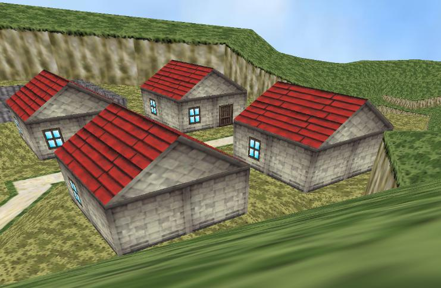

<div align="center">

## ZSoft 3D Engine


</div>

### Description

Just an update from my engine, it is supposed to be an rpg in the future. For now you can only walk around a little village. The game editor is also included. The file is 1.5 mb so psc wont let me upload it, please download it from www.tripod.com/andres_zacarias/Files/GameWOF1-7.zip . Comments, votes or anything else is welcome.

Try this link if above is not working: www.geocities.com/do_you_kaposai/GameWOF1-7.zip
 
### More Info
 


<span>             |<span>
---                |---
**Submitted On**   |
**By**             |[Andres Zacarias](https://github.com/Planet-Source-Code/PSCIndex/blob/master/ByAuthor/andres-zacarias.md)
**Level**          |Intermediate
**User Rating**    |4.6 (46 globes from 10 users)
**Compatibility**  |VB 6\.0
**Category**       |[DirectX](https://github.com/Planet-Source-Code/PSCIndex/blob/master/ByCategory/directx__1-44.md)
**World**          |[Visual Basic](https://github.com/Planet-Source-Code/PSCIndex/blob/master/ByWorld/visual-basic.md)
**Archive File**   |[](https://github.com/Planet-Source-Code/andres-zacarias-zsoft-3d-engine__1-42553/archive/master.zip)


### Source Code

```
The file is 1.5 mb so psc wont let me upload it, please download it from www.tripod.com/andres_zacarias/Files/GameWOF1-7.zip .
or
www.geocities.com/do_you_kaposai/GameWOF1-7.zip
```

